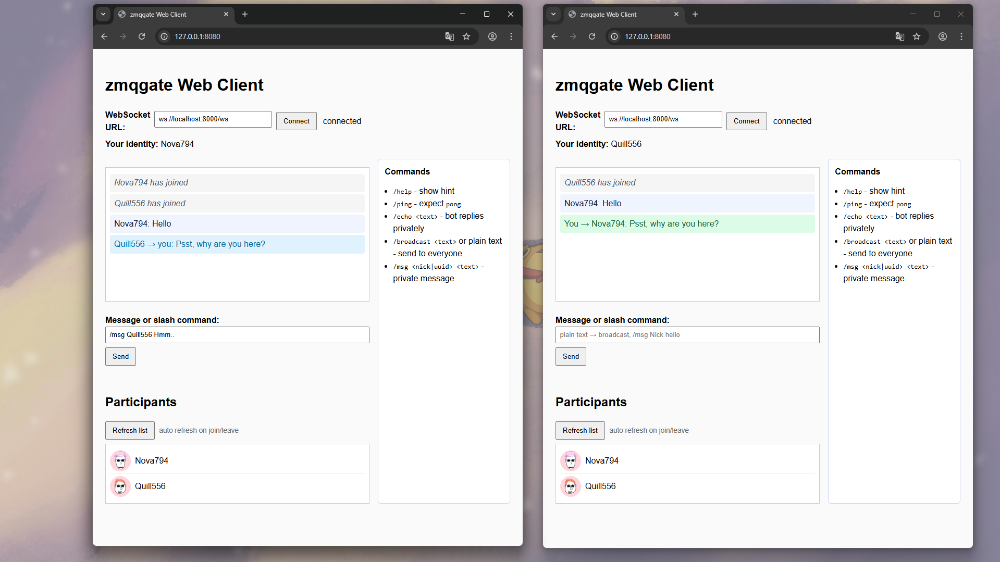

# Пример чата через zmqgate



В этом примере `zmqgate` пересылает websocket-сообщения через TCP к боту который управляет чатом. Веб-клиент отображает чат и список участников.

## Возможности

- общий чат, с подтветкой приватных и системных сообщений
- список участников
- команды (`/help`, `/ping`, `/broadcast`, `/msg <nick|uuid>`, `/clients` и др.)
- дополнительный CLI-клиент в `client.py`

## Как запустить

```bash
python3 -m pip install -r requirements.txt
zmqgate -c zmqgate-tcp.yaml
python3 bot.py
python3 webclient.py
```

Сервер `webclient.py` по умолчанию слушает `http://127.0.0.1:8080/`; откройте его в браузере, можно сразу в нескольких вкладках. CLI-клиент (`python3 client.py`) остаётся опциональным, но пригодится для отправки команд вручную.

## Что можно делать

1. Подключитесь в браузере, получите ник и аватарку.  
2. Общайтесь с другими клиентами.  
3. Используйте `/msg <nick|uuid> <текст>` для приватных сообщений.


Это минимальный пример возможностей, который можно развить в более сложную систему с несколькими каналами, личными сообщениями и сценариями обмена данными между сервисами через `AJAX/WebSocket → ZeroMQ → ваш сервис`.
